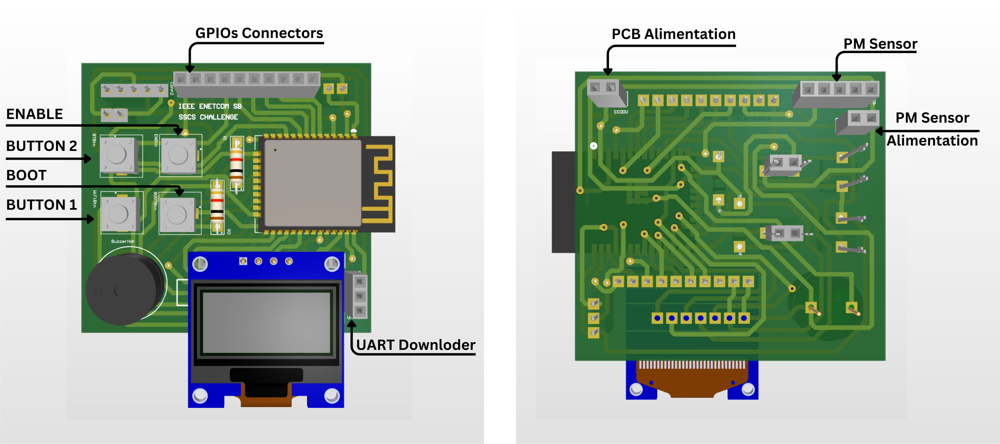
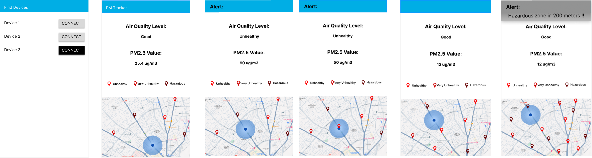

# Welcome to our challenge
This is the repository of the IEEE ENETCOM SB SSCS Challenge Solution, includes the PCB Project Files, Schematics, BOM and Mobile Application files.

The idea is to provide a connected, user friendly and portable Device that users can use it everywhere to continuously track PM concentration variations during the day and collect the positions that have High level of pm that have impacts on health and environment. So that we can understand the PM effects and identify the polluted areas.

**you can find all the videos and ressources in this drive link**: https://drive.google.com/drive/folders/1HXeUyAUTR0sB1u9onVeRCmz1DxdLYg1b

Figma Link : https://www.figma.com/proto/DNSt179h4LZe5pDveEG5xY/SSCS-Challenge?type=design&node-id=16-255&t=hDU6FsBZ0SjsDfjW-1&scaling=scale-down&page-id=0%3A1&starting-point-node-id=1%3A3&mode=design

PDF Report Link: 
https://drive.google.com/file/d/11JHWgoeEZgktFuuwM_QtaIk6NvQT4zlR/view?usp=sharing

# PCB Design

  

# Mobile Application

  

# Technologies Used:
Bluetooth Low Energy
Flutter
Firebase 

